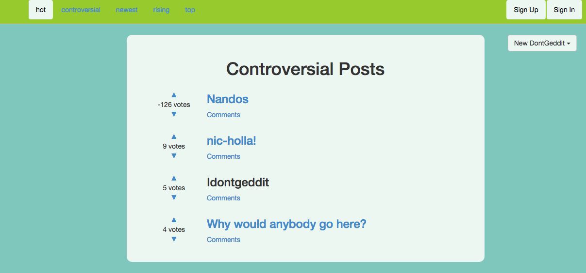

iDontGeddit
===========

Week 9 Challenge at Makers Academy was to create a content aggregator site, similar to reddit 



The live site can be seen here:

http://idontgeddit.herokuapp.com/


###Specification
+ Users can to submit content
+ Users can upvote and downvote posts
+ Users can comment on posts
+ Posts can be displayed by different rankings - 'hot', 'new', 'controversial', 'rising', and 'top

###Technologies used

+ Ruby
+ Rails
+ RSPEC
+ Capybara
+ PSQL
+ HTML
+ CSS
+ Bootstrap
+ Devise
+ Factory Girl
+ Warden
+ Timecop
+ Capybara

###How to set it up

```sh
git clone https://github.com/aitkenster/idontgeddit.git
cd idontgeddit
bundle install
```

###How to run it

```sh
cd idontgeddit
rails s
```

Open the browser to localhost:3000 to view the app.

###How to test it

```sh
cd idontgeddit
rspec
``` 

###Future Improvements

+ Add ajax to stop the page moving when you upvote and downvote content.
